# API DioFLIX

Este projeto tem como objetivo demonstrar o uso de microserviços utilizando os recursos do Microsoft Azure.

## Recursos Utilizados

- [x] Grupo de Recursos
- [x] API Management
- [x] Cosmos DB
- [x] Storage Account
- [x] Azure Function Local

## Pré-requisitos

Para executar este projeto, você precisa ter as seguintes ferramentas instaladas:

- Visual Studio (ou IDE de sua preferência)
- .NET 8.0
- Postman (para testar as APIs)
- Conta no Microsoft Azure


---


## Como Criar a Infraestrutura no Azure

Para criar a infraestrutura necessária no portal do Azure, siga os passos abaixo:

1. **Criar um Grupo de Recursos**  
   - No portal do Azure, crie um novo *Grupo de Recursos* com o nome: `flixdio`.

2. **Criar o API Management**  
   - Crie um novo *API Management Service* com o nome: `apiflixdio01`.
   - Defina o *Pricing Tier* como `Consumption`.

3. **Criar o Azure Cosmos DB**  
   - Crie um *Azure Cosmos DB* com o nome: `cosmosdbflixdio01`.
   - Selecione a opção *NoSQL* e utilize o modo *Serverless*.

4. **Criar uma Conta de Armazenamento (Storage Account)**  
   - Crie uma *Storage Account* com o nome: `storageaccountdiod01`.
   - Defina o *Primary Service* como *Azure Blob Storage* e ative o *Data Lake Storage Gen2*.
   - Nas configurações avançadas, habilite o *Acesso Anônimo*.

5. **Configurar Containers no Storage Account**  
   - Após a criação da *Storage Account*, acesse `storageaccountdiod01`.
   - Navegue até *Navegador de Armazenamento* > *Contêineres de Blob*.
   - Clique em **+ Adicionar** para criar dois contêineres:
     - **video** (Permitir acesso para leitura).
     - **image** (Permitir acesso para leitura).


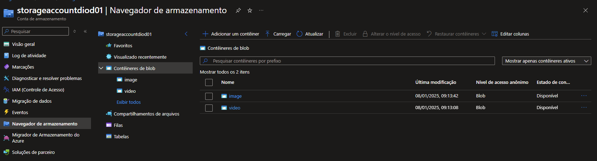

Ou No Powershell do Azure

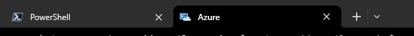

```shell
# Criando as variáveis
myRG=flixdio
myApiManagement=apiflixdio01
myCosmosDB=cosmosdbflixdio01
myLocation=eastus
myStorageAccount=storageaccountdiod0
myEmail=sandrosa0315@outlook.com

# Criar o Grupo de Recursos com o nome: flixdio
az group create --name $myRG --location $myLocation

# Criar um serviço de API Management com o nome: api-flix-dio e o plano de preços: Consumption
az apim create --name $myApiManagement -g $myRG -l $myLocation --publisher-email $myEmail --publisher-name FlixDio --sku-name Consumption

# Verificar se o provider DocumentDB está registrado. Se estiver "Registered", pule o próximo passo
az provider show --namespace Microsoft.DocumentDB --query "registrationState"

# Caso não esteja registrado, use o comando abaixo para registrar, e utilize o comando acima para verificar se está sendo registrado ou já foi registrado
# Aguarde até ser registrado como "Registered"
az provider register --namespace Microsoft.DocumentDB

# Se já estiver registrado, siga.
# Criar um Azure Cosmos DB / NoSQL com o nome: cosmosdbflixdiodevsa001 / serverless
# Utilizamos outra região porque a East US estava com alta demanda --locations regionName=WestUS
# Você precisa apagar o processo anterior caso ocorra erro devido à alta demanda: az cosmosdb delete --name $myCosmosDB --resource-group $myRG --yes
az cosmosdb create --name $myCosmosDB --resource-group $myRG --kind MongoDB --server-version 3.6 --locations regionName=WestUS failoverPriority=0 isZoneRedundant=False --enable-serverless true

# Verificar se o provider Microsoft.Storage está registrado. Se estiver "Registered", pule o próximo passo
az provider show --namespace Microsoft.Storage --query "registrationState"

# Caso não esteja registrado, use o comando abaixo para registrar, e utilize o comando acima para verificar se está sendo registrado ou já foi registrado
# Aguarde até ser registrado como "Registered"
az provider register --namespace Microsoft.Storage

# Criar uma Conta de Armazenamento (Storage Account) com o nome: staflixdiodevsa001, serviço primário: Azure Blob Storage Data Lake Storage Gen2, permitir acesso anônimo
az storage account create --name $myStorageAccount --resource-group $myRG --location $myLocation --sku Standard_LRS --kind StorageV2 --allow-blob-public-access true

# Criação do contêiner
az storage container create --name video --account-name $myStorageAccount

# Permitir acesso público para leitura no contêiner
az storage container set-permission --name video --account-name $myStorageAccount --public-access blob

# Criação do contêiner
az storage container create --name image --account-name $myStorageAccount

# Permitir acesso público para leitura no contêiner
az storage container set-permission --name image --account-name $myStorageAccount --public-access blob

```

---

## Criando a infraestrutura para salvar no Storage Account

No Visual Studio, crie um novo projeto do tipo Azure Function com o nome: ``fnPostDataStore``.

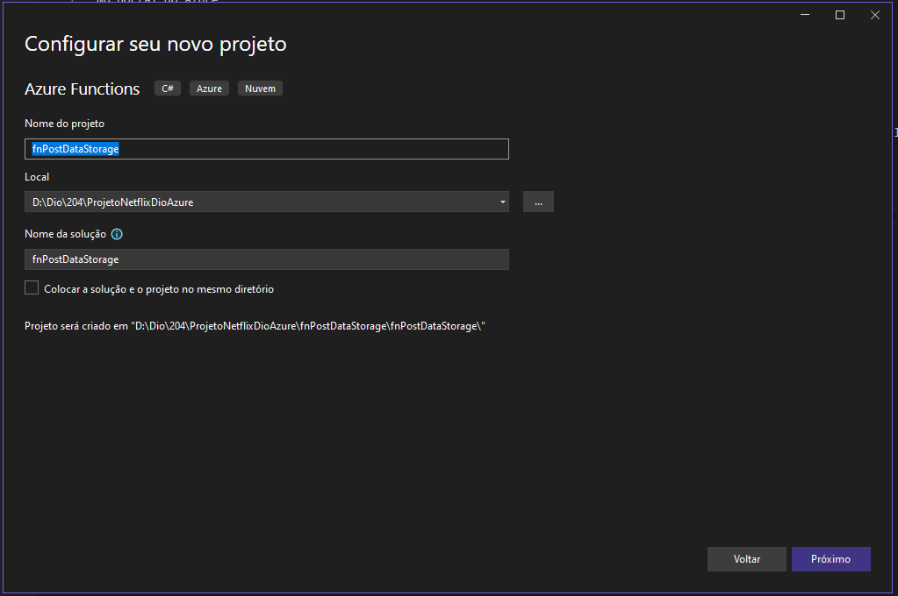

Utilize a função **Http Trigger**.

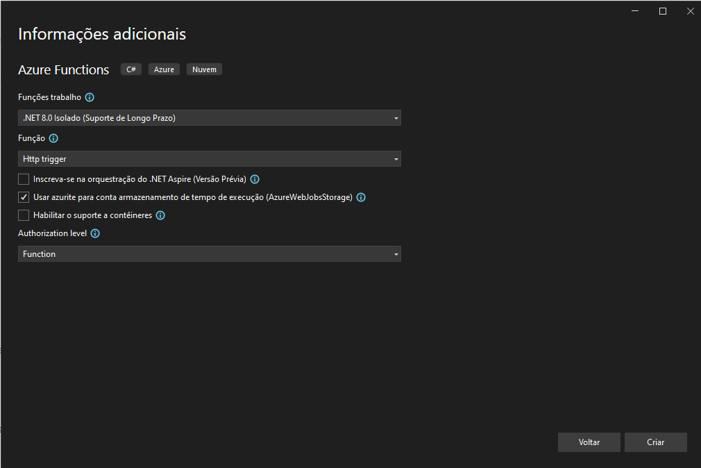

As funções de armazenamento precisam de configurações para parametrizar o limite de upload.

Em ``program.cs`` edite para permitir o recebimento de arquivos de até 100MB de tamanho.

```cs

using Microsoft.AspNetCore.Server.Kestrel.Core;
using Microsoft.Azure.Functions.Worker.Builder;
using Microsoft.Extensions.DependencyInjection;
using Microsoft.Extensions.Hosting;

var builder = FunctionsApplication.CreateBuilder(args);

builder.ConfigureFunctionsWebApplication();

// Application Insights isn't enabled by default. See https://aka.ms/AAt8mw4.
// builder.Services
//     .AddApplicationInsightsTelemetryWorkerService()
//     .ConfigureFunctionsApplicationInsights();
builder.Services.Configure<KestrelServerOptions>(options =>
{
    options.Limits.MaxRequestBodySize = 1024 * 1024 * 100; // 100MB
});
builder.Build().Run()

```
Acesse o portal do Azure 

Em storageaccountdiod01 /security / Access Key copie a chave de acesso.

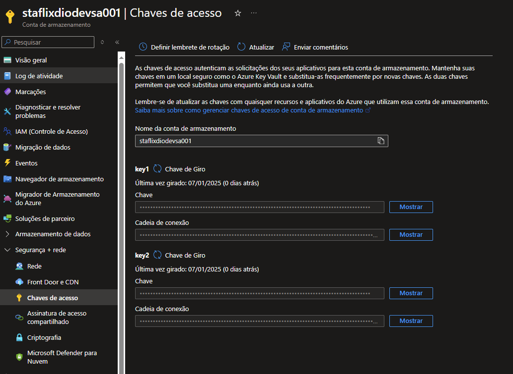

Agora, vamos inserir a chave no arquivo ``local.settings.json``
  
```json

{
    "IsEncrypted": false,
    "Values": {
        "AzureWebJobsStorage": "minha cadeia de conexão",
        "FUNCTIONS_WORKER_RUNTIME": "dotnet-isolated"
    }
}

```

Em ``Functions1.cs`` faremos as validações para o upload do arquivo

```cs

public async Task<IActionResult> Run([HttpTrigger(AuthorizationLevel.Function, "post")] HttpRequest req)
{
    _logger.LogInformation("Processando a imagem no storage ...");

    try
    {
        if (!req.Headers.TryGetValue("file-type", out var filetypeHeader))
        {
            return new BadRequestObjectResult("O cabe�alho file-type e obrigat�rio");
        }

        var fileType = filetypeHeader.ToString();
        var form = await req.ReadFormAsync();
        var file = form.Files["file"];

        if (file == null || file.Length == 0)
        {
            return new BadRequestObjectResult("O arquivo n�o foi enviado");
        }

        string connectionString = Environment.GetEnvironmentVariable("AzureWebJobsStorage");
        string containerName = fileType;
        BlobClient blobClient = new BlobClient(connectionString, containerName, file.FileName);
        BlobContainerClient containerClient = new BlobContainerClient(connectionString, containerName);

        await containerClient.CreateIfNotExistsAsync();

        await containerClient.SetAccessPolicyAsync(PublicAccessType.BlobContainer);

        string blobName = file.FileName;
        var blob = containerClient.GetBlobClient(blobName);

        using (var stream = file.OpenReadStream())
        {
            await blob.UploadAsync(stream, true);
        }

        _logger.LogError($"Enviado ${file.FileName} armazenado com sucesso");

        return new OkObjectResult(new
        {
            Message = "Imagem enviada com sucesso",
            BlobUri = blob.Uri
        });

    }
    catch (Exception ex)
    {
        _logger.LogError(ex, "Erro ao processar a imagem no storage");
        return new StatusCodeResult(StatusCodes.Status500InternalServerError);
    }
}

```

Caso ``BlobClient`` não esteja presente, utilize o NuGet para instalar.

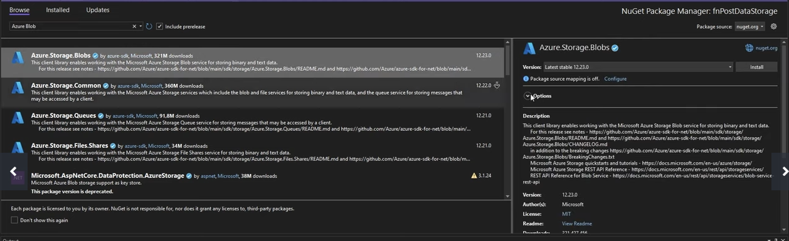

Inicie a função ``fnPostDataStorage``, sem depuração. Tudo estará certo, e um terminal CMD será aberto com o endereço local para upload.

#### Usando o Postman

1. Inicie o endereço local em um POST.

 
2. Configure os Headers. Altere para image quando for enviar uma imagem
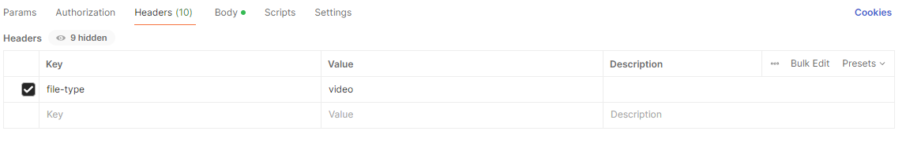

3. Configure o Body, enviando um vídeo e uma imagem.
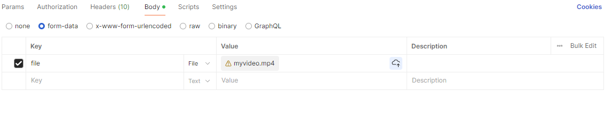

Copie os retornos e salve em um bloco de notas.

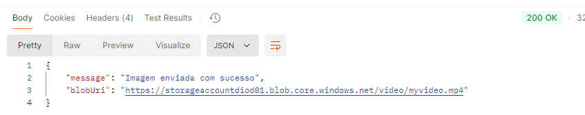

Pare o projeto no Visual Studio após testar

---

## Criando uma Azure Function para salvar em um CosmosDB

No Visual Studio, adicione um novo projeto do tipo Azure Function com o nome: ``fnPostDatabase``. 
Utilize a função **Http Trigger**.

No portal do Azure, em cosmosdbflixdio01 / Configurações / Chaves, visualize e copie a cadeia de conexão primária.

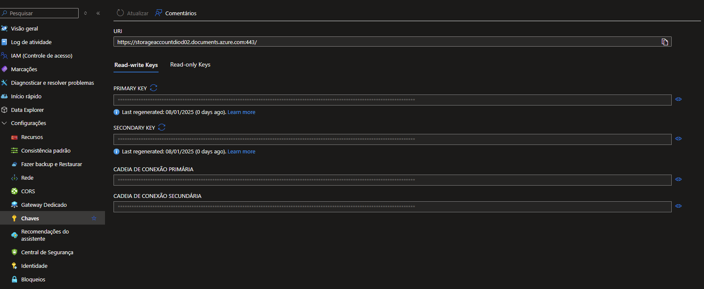

Em cosmosdbflixdio01, crie um novo banco de dados.

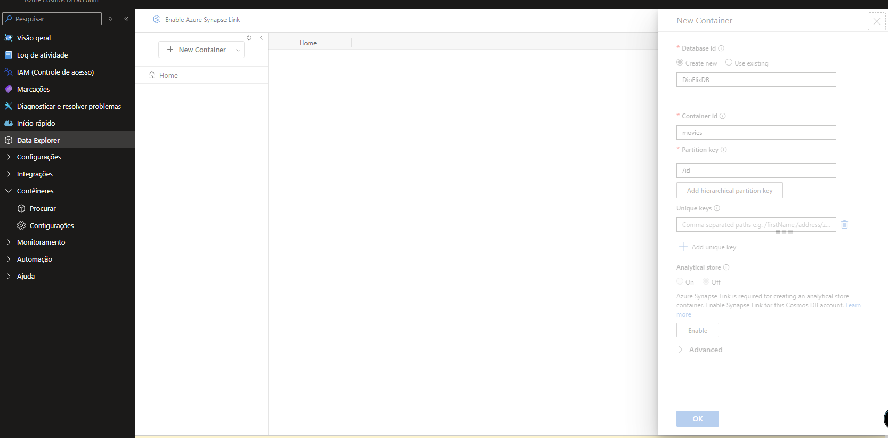

Agora, vamos editar o arquivo ``local.settings.json`` e colar a cadeia de conexão primária.

```json

{
    "IsEncrypted": false,
    "Values": {
        "AzureWebJobsStorage": "UseDevelopmentStorage=true",
        "FUNCTIONS_WORKER_RUNTIME": "dotnet-isolated",
        "CosmoDBConnection": "<cadeia de conexão primaria>",
        "databaseName": "DioFlixDB",
        "ContainerName": "movies"
    }
}

```
Vamos instalar as dependências necessárias, Utilize o NuGet para instalar as dependências:

1. Microsoft.Azure.Functions.Worker.CosmosDB

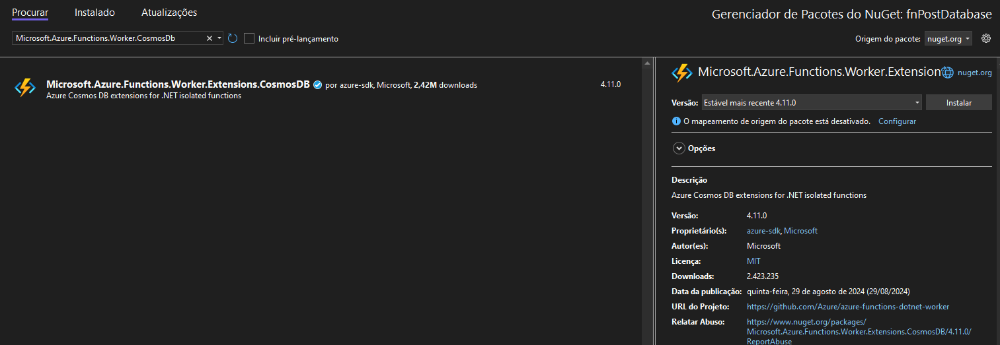

2. Newtonsoft.json

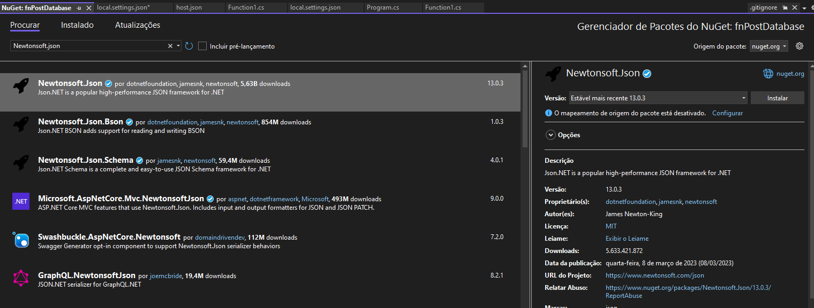

Agora, crie o arquivo ``MovieRequest.cs`` para receber os parâmetros da requisição.

```cs
using System;
using System.Collections.Generic;
using System.Linq;
using System.Text;
using System.Threading.Tasks;

namespace fnPostDatabase
{
    internal class MovieRequest
    {
        public string id { get { return Guid.NewGuid().ToString(); } }
        public string title { get; set; }
        public string year { get; set; }
        public string video { get; set; }
        public string thumb { get; set; }
    }
}

```

Em seguida vamos editar o arquivo ``Function1.cs``

```cs

using Microsoft.AspNetCore.Http;
using Microsoft.AspNetCore.Mvc;
using Microsoft.Azure.Functions.Worker;
using Microsoft.Extensions.Logging;
using Newtonsoft.Json;

namespace fnPostDatabase
{
    public class Function1
    {
        private readonly ILogger<Function1> _logger;

        public Function1(ILogger<Function1> logger)
        {
            _logger = logger;
        }

        [Function("movie")]
        [CosmosDBOutput("%DatabaseName%", "movies", Connection = "CosmoDBConnection", CreateIfNotExists = true, PartitionKey = "id")]
        public async Task<object?> Run([HttpTrigger(AuthorizationLevel.Function, "post")] HttpRequest req)
        {
            _logger.LogInformation("C# HTTP trigger function processed a request.");

            MovieRequest movie = null;

            var content = await new StreamReader(req.Body).ReadToEndAsync();

            try
            {
                movie = JsonConvert.DeserializeObject<MovieRequest>(content);
            }
            catch (Exception ex)
            {
                return new BadRequestObjectResult("Erro ao deserializar o objeto: " + ex.Message);
            }

            return JsonConvert.SerializeObject(movie);
        }
    }
}


```

Inicie a função ``fnPostDataStorage``, sem depuração. Tudo estará certo, e um terminal CMD será aberto com o endereço local para utilizamos.

Copie o endereço local mostrado no CMD.

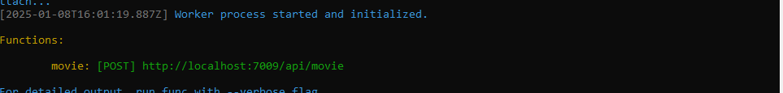

E utilize-o no Postman para persistir os dados no Cosmos DB.

Salve e Send para testar

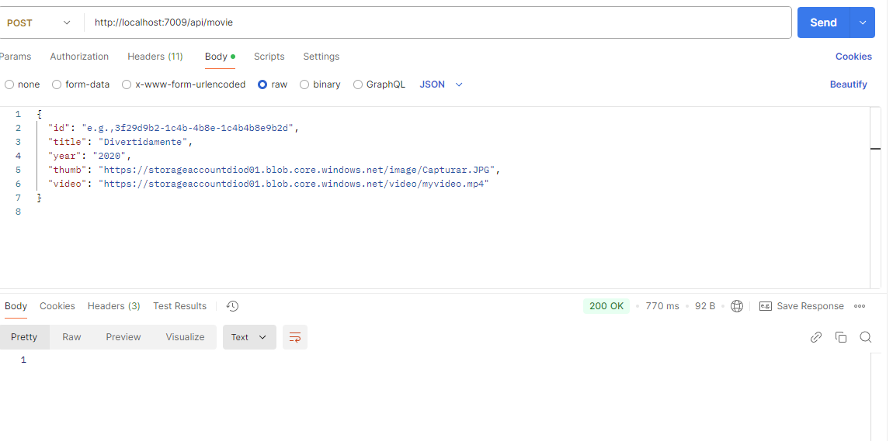


Pare a execução do programa após testar

---

## Criando uma Azure Fuction para Filtrar Registros no CosmosDB

No Visual Studio, crie um novo projeto Azure Function com o nome: ``fnGetAllDetail``.
Utilize a função **Http Trigger**.


Agora, criamos o arquivo ``MovieResult.cs`` para buscar os parâmetros da requisição.

```cs

namespace fnGetAllDetail
{
    internal class MovieResult
    {

        public string id { get; set; }
        public string title { get; set; }
        public string year { get; set; }
        public string video { get; set; }
        public string thumb { get; set; }
        

    }
}


```

Vamos instalar as dependências necessárias, Utilize o NuGet para instalar as dependências:

1. Microsoft.Azure.Functions.Worker.CosmosDB


2. Newtonsoft.json


Agora, vamos editar o arquivo ``local.settings.json`` e colar a cadeia de conexão primária. Aqui, precisamos liberar o CORS.

```json
{
    "IsEncrypted": false,
    "Values": {
        "AzureWebJobsStorage": "UseDevelopmentStorage=true",
        "FUNCTIONS_WORKER_RUNTIME": "dotnet-isolated",
        "CosmoDBConnection": "<cadeia de conexão primaria>"
    },
    "Host": {
        "CORS": "*"
    }

}
```

Em ``Program.cs``, vamos editar e utilizar o padrão ``Singleton``.

```cs
using Microsoft.Azure.Cosmos;
using Microsoft.Azure.Functions.Worker.Builder;
using Microsoft.Extensions.DependencyInjection;
using Microsoft.Extensions.Hosting;

var builder = FunctionsApplication.CreateBuilder(args);

builder.ConfigureFunctionsWebApplication();

// Application Insights isn't enabled by default. See https://aka.ms/AAt8mw4.
// builder.Services
//     .AddApplicationInsightsTelemetryWorkerService()
//     .ConfigureFunctionsApplicationInsights();

builder.Services.AddSingleton( s =>
{
    string connectionString = Environment.GetEnvironmentVariable("CosmoDBConnection");
    return new CosmosClient(connectionString);
});

builder.Build().Run();

```

Em seguida vamos editar o arquivo ``Function1.cs``

```cs
using Microsoft.Azure.Cosmos;
using Microsoft.Azure.Functions.Worker;
using Microsoft.Azure.Functions.Worker.Http;
using Microsoft.Extensions.Logging;

namespace fnGetAllDetail
{
    public class Function1
    {
        private readonly ILogger<Function1> _logger;
        private readonly CosmosClient _cosmosClient;

        public Function1(ILogger<Function1> logger, CosmosClient cosmosClient)
        {
            _logger = logger;
            _cosmosClient = cosmosClient;
        }

        [Function("detail")]
        public  async Task<HttpResponseData> Run([HttpTrigger(AuthorizationLevel.Function, "get")] HttpRequestData req)
        {
            _logger.LogInformation("C# HTTP trigger function processed a request.");

            var container = _cosmosClient.GetContainer("DioFlixDB", "movies");
            var id = req.Query["id"];
            var query = $"SELECT * FROM c WHERE c.id = @id";
            var queryDefinition = new QueryDefinition(query).WithParameter("@id", id);
            var result = container.GetItemQueryIterator<MovieResult>(queryDefinition);

            var results = new List<MovieResult>();

            while (result.HasMoreResults)
            {
                foreach (var item in await result.ReadNextAsync())
                {
                    results.Add(item);
                }
            }

            var responseMessage = req.CreateResponse(System.Net.HttpStatusCode.OK);
            await responseMessage.WriteAsJsonAsync(results.FirstOrDefault());

            return responseMessage;
        }
    }
}


```

Inicie a função ``fnGetAllDetail``, sem depuração. Tudo estará certo, e um terminal CMD será aberto com o endereço local para utilizamos.
Copie o endereço local mostrado no CMD.
E utilize-o no Postman para consumir os dados de uma determinado ID.

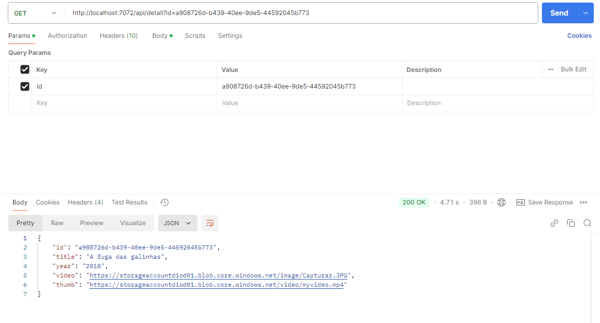

---

## Criando uma Azure Fuction para Listar Registros no CosmosDB

No Visual Studio, crie um novo projeto Azure Function com o nome: ``fnGetAllMovies``.
Utilize a função **Http Trigger**.

Agora, criamos o arquivo ``MovieResult.cs`` para buscar os parâmetros da requisição.

```cs

namespace fnGetAllMovies
{
    internal class MovieResult
    {

        public string id { get; set; }
        public string title { get; set; }
        public string year { get; set; }
        public string video { get; set; }
        public string thumb { get; set; }
        

    }
}


```
Vamos instalar as dependências necessárias, Utilize o NuGet para instalar as dependências:

1. Microsoft.Azure.Functions.Worker.CosmosDB


2. Newtonsoft.json


Agora, vamos editar o arquivo ``local.settings.json`` e colar a cadeia de conexão primária. Aqui, precisamos liberar o CORS.

```json
{
    "IsEncrypted": false,
    "Values": {
        "AzureWebJobsStorage": "UseDevelopmentStorage=true",
        "FUNCTIONS_WORKER_RUNTIME": "dotnet-isolated",
        "CosmoDBConnection": "<cadeia de conexão primaria>"
    },
    "Host": {
        "CORS": "*"
    }

}
```

Em ``Program.cs``, vamos editar e utilizar o padrão ``Singleton``.

```cs
using Microsoft.Azure.Cosmos;
using Microsoft.Azure.Functions.Worker.Builder;
using Microsoft.Extensions.DependencyInjection;
using Microsoft.Extensions.Hosting;

var builder = FunctionsApplication.CreateBuilder(args);

builder.ConfigureFunctionsWebApplication();

// Application Insights isn't enabled by default. See https://aka.ms/AAt8mw4.
// builder.Services
//     .AddApplicationInsightsTelemetryWorkerService()
//     .ConfigureFunctionsApplicationInsights();

builder.Services.AddSingleton( s =>
{
    string connectionString = Environment.GetEnvironmentVariable("CosmoDBConnection");
    return new CosmosClient(connectionString);
});

builder.Build().Run();

```

Em seguida vamos editar o arquivo ``Function1.cs``

```cs
using Microsoft.AspNetCore.Http;
using Microsoft.Azure.Cosmos;
using Microsoft.Azure.Functions.Worker;
using Microsoft.Azure.Functions.Worker.Http;
using Microsoft.Extensions.Logging;

namespace fnGetAllMoveis
{
    public class Function1
    {
        private readonly ILogger<Function1> _logger;
        private readonly CosmosClient _cosmosClient;

        public Function1(ILogger<Function1> logger, CosmosClient cosmosClient)
        {
            _logger = logger;
            _cosmosClient = cosmosClient;
        }

        [Function("all")]
        public async Task<HttpResponseData> Run([HttpTrigger(AuthorizationLevel.Function, "get")] HttpRequestData req)
        {
            _logger.LogInformation("C# HTTP trigger function processed a request.");

            var container = _cosmosClient.GetContainer("DioFlixDB", "movies");
            var query = $"SELECT * FROM c";
            var queryDefinition = new QueryDefinition(query);
            var result = container.GetItemQueryIterator<MovieResult>(queryDefinition);

            var results = new List<MovieResult>();

            while (result.HasMoreResults)
            {
                foreach (var item in await result.ReadNextAsync())
                {
                    results.Add(item);
                }
            }

            var responseMessage = req.CreateResponse(System.Net.HttpStatusCode.OK);
            await responseMessage.WriteAsJsonAsync(results);

            return responseMessage;
        }
    }
}

```

Inicie a função ``fnGetAllDetail``, sem depuração. Tudo estará certo, e um terminal CMD será aberto com o endereço local para utilizamos.
Copie o endereço local mostrado no CMD.
E utilize-o no Postman para consumir os dados.

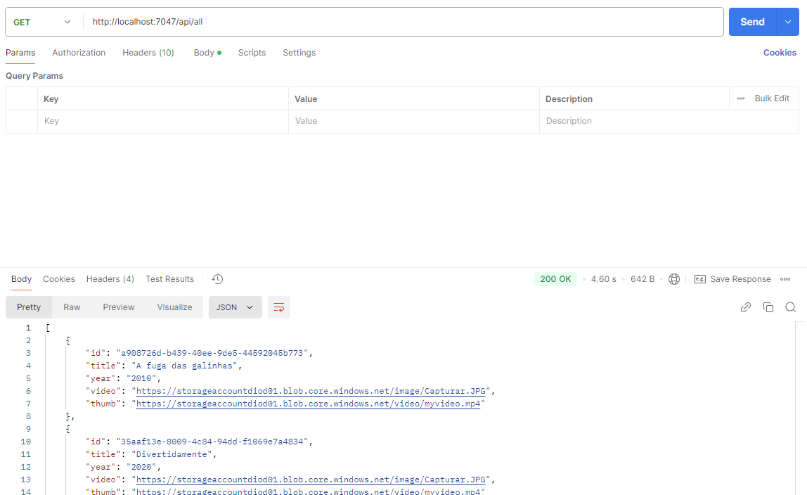

---
## Construindo um Front-End

Aqui, vamos construir um front-end para o consumo da ``fnGetAllMovies``.

```html
<!doctype html>
<html lang="en">
  <head>
    <meta charset="utf-8">
    <meta name="viewport" content="width=device-width, initial-scale=1">
    <link href="https://cdn.jsdelivr.net/npm/bootstrap@5.3.3/dist/css/bootstrap.min.css" rel="stylesheet" integrity="sha384-QWTKZyjpPEjISv5WaRU9OFeRpok6YctnYmDr5pNlyT2bRjXh0JMhjY6hW+ALEwIH" crossorigin="anonymous">
    <title>Lista de Filmes</title>
  </head>
  <body>
    <div class="container my-4">
        <h1 class="text-center mb-4">Lista de Filmes</h1>
        <div id="movie-list" class="row g-4"></div>
    </div>

    <script>
        document.addEventListener('DOMContentLoaded', function() {
            fetch('http://localhost:7047/api/all')
                .then(response => response.json())
                .then(movies => {
                    const movieList = document.getElementById('movie-list');

                    movies.forEach(movie => {
                        const col = document.createElement('div');
                        col.className = 'col-md-4';

                        const card = document.createElement('div');
                        card.className = 'card h-100 shadow-sm';

                        const thumb = document.createElement('img');
                        thumb.src = movie.thumb;
                        thumb.className = 'card-img-top';
                        card.appendChild(thumb);

                        const cardBody = document.createElement('div');
                        cardBody.className = 'card-body';

                        const title = document.createElement('h5');
                        title.className = 'card-title';
                        title.textContent = movie.title;
                        cardBody.appendChild(title);

                        const year = document.createElement('p');
                        year.className = 'card-text';
                        year.textContent = `Ano: ${movie.year}`;
                        cardBody.appendChild(year);

                        const video = document.createElement('video');
                        video.src = movie.video;
                        video.controls = true;
                        video.className = 'w-100 mt-2';
                        cardBody.appendChild(video);

                        card.appendChild(cardBody);
                        col.appendChild(card);
                        movieList.appendChild(col);
                    });
                })
                .catch(error => console.error('Erro ao buscar os filmes:', error));
        });
    </script>

    <script src="https://cdn.jsdelivr.net/npm/bootstrap@5.3.3/dist/js/bootstrap.bundle.min.js" integrity="sha384-YvpcrYf0tY3lHB60NNkmXc5s9fDVZLESaAA55NDzOxhy9GkcIdslK1eN7N6jIeHz" crossorigin="anonymous"></script>
  </body>
</html>

```

Veja com fica

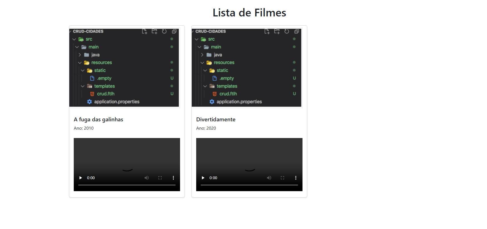

---

## Conclusão

Com os passos acima, você configurou, desenvolveu, testou e publicou suas **Azure Function**  Agora, você pode integrar essa função em outras aplicações ou utilizá-la em qualquer serviço que suporte requisições HTTP.

Se tiver dúvidas ou problemas, sinta-se à vontade para abrir uma **issue** ou perguntar!

---
